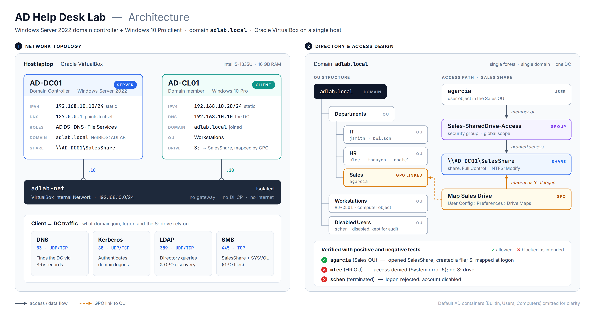

# Active Directory Help Desk Lab

A small Windows domain built from scratch in VirtualBox to practise the work an IT
support or service desk technician does every day: account lifecycle management,
group-based access control, shared folder permissions, Group Policy, and the
troubleshooting that goes with all of it.

Every change in this lab was verified from the end user's side, not just from the
admin console, and each task is written up as a help desk ticket — including the
things that broke along the way.

**Domain:** `adlab.local` · **Hypervisor:** Oracle VirtualBox · **Built:** May–Sept 2026

---

## Architecture



### Service inventory

| Host | Role | OS | IP | DNS | Services |
|---|---|---|---|---|---|
| AD-DC01 | Domain controller | Windows Server 2022 | 192.168.10.10/24 (static) | 127.0.0.1 | AD DS, DNS, File Services (SalesShare), SYSVOL/NETLOGON |
| AD-CL01 | Domain workstation | Windows 10 Pro | 192.168.10.20/24 (static) | 192.168.10.10 | Domain member, S: drive mapped by GPO |
| adlab-net | VirtualBox internal network | — | 192.168.10.0/24 | — | Isolated: no gateway, no DHCP, no internet |

The lab runs on an isolated internal network with static addressing. A domain
controller cannot use DHCP: clients depend on its address for DNS and domain
location, so the address has to be fixed.

### Directory design

```
adlab.local
├── Departments
│   ├── IT              jsmith, bwilson
│   ├── HR              mlee, tnguyen, rpatel
│   └── Sales           agarcia          ← GPO "Map Sales Drive" linked here
├── Workstations        AD-CL01 (computer object)
└── Disabled Users      schen (terminated, retained for audit)
```

| Security group | Scope | Grants |
|---|---|---|
| `Sales-SharedDrive-Access` | Global | Modify (NTFS) on `\\AD-DC01\SalesShare` |
| `HR-SharedDrive-Access` | Global | Reserved for HR resources |
| `IT-Admins-Test` | Global | Test group for delegation scenarios |

Users live inside their department OU rather than at the top of `Departments`, so
Group Policy and delegation follow the org chart. `AD-CL01` was moved out of the
default `Computers` container into a `Workstations` OU, because GPOs cannot be
linked to a container.

---

## What this lab demonstrates

- Installing AD DS and promoting a server to a domain controller in a new forest
- DNS as the mechanism domain clients use to locate a domain controller
- Domain join, and diagnosing why it fails
- OU design, user and group provisioning, and role-based access
- The full account lifecycle: provisioning, password reset, lockout, suspension,
  reinstatement, department transfer, and termination
- Share and NTFS permissions, including disabling inheritance
- Group Policy Preferences, OU scoping, and verifying policy application with `gpresult`

---

## Help desk tickets

Ten tasks documented in ticket form, with symptoms, actions, verification and
prevention notes: **[docs/helpdesk-tickets.md](docs/helpdesk-tickets.md)**

| # | Ticket | Category |
|---|---|---|
| 001 | Password reset request | Authentication |
| 002 | Account lockout | Authentication |
| 003 | Temporary account suspension (leave) | Access control |
| 004 | Account reactivation (return from leave) | Access control |
| 005 | Employee termination: access revocation | Offboarding |
| 006 | Internal transfer: Sales to HR | Access control |
| 007 | New hire account provisioning | Onboarding |
| 008 | Post-change verification sweep | Quality assurance |
| 009 | Department share access control | File services |
| 010 | Automated drive mapping via Group Policy | Group Policy |

---

## Access control, verified both ways

Granting access proves very little on its own. Each control was tested from the
allowed side and the denied side.

**Authorised user** — `agarcia`, a member of `Sales-SharedDrive-Access`, opens the
share and writes to it:


**Unauthorised user** — `mlee` (HR, not a member of the group) is refused:


**Disabled account** — a terminated user cannot authenticate:


---

## Troubleshooting log

The problems were the most useful part of building this.

**Both VMs were unreachable to each other, and ping "succeeded" anyway.**
VirtualBox's default NAT gives every VM its own isolated network, and each one is
issued the same address, `10.0.2.15`. A ping from the client to that address never
left the machine — it looped back to itself and reported success. Moving both VMs to
an internal network and assigning static addresses fixed it. A green result from a
test that cannot fail is worse than no test.

**No DHCP server on an internal network.**
After the move, both machines self-assigned `169.254.x.x` APIPA addresses, because
DHCP was still enabled and nothing was answering. This is why a domain controller is
statically addressed rather than relying on a lease.

**Name resolution failed while the network was fine.**
`ping` to the DC's IP worked, but `nslookup adlab.local` failed. The client's DNS
server had been entered as `198.168.10.10` instead of `192.168.10.10`. One digit.
Public DNS resolvers have never heard of `adlab.local`, so a client that is not
pointed at the domain controller cannot find the domain at all.

**Share unreachable: "An extended error has occurred."**
`net use` returned **System error 53** (network path not found) rather than **error
5** (access denied), which separates two very different problems: 53 means the path,
name resolution or SMB is wrong, while 5 means the path resolved and permissions
refused it. `net view \\AD-DC01` showed a share named `Shares` and no `SalesShare` —
the parent directory had been published instead of the intended subdirectory.

**GPO applied but the drive never appeared.**
`gpresult /r` confirmed *Map Sales Drive* under Applied Group Policy Objects, which
ruled out scoping and permissions and isolated the fault to the mapping itself. The
UNC path in the Drive Maps preference was malformed. A drive map fails silently at
logon, because there is no interactive session to show an error.

---

## Change log

| Date | Change | Why |
|---|---|---|
| 2026-05 | Built AD-DC01, promoted to DC, created forest `adlab.local` | Identity foundation |
| 2026-07-18 | Moved both VMs from NAT to internal network `adlab-net`; static IPs assigned | NAT isolated the VMs from each other; the DC needs a stable address |
| 2026-07-18 | Corrected AD-CL01's DNS server to 192.168.10.10 | `adlab.local` resolves only on the DC |
| 2026-07 | Joined AD-CL01 to the domain; moved it to the Workstations OU | GPOs cannot be linked to the default Computers container |
| 2026-08-15 | Built OU structure, users and security groups | Access by role rather than by individual |
| 2026-08-15 | Account lockout policy: 3 attempts / 30 minutes | Windows Server ships with no lockout threshold |
| 2026-09-05 | Created SalesShare (share: Full Control, NTFS: Modify for the Sales group) | Group-based resource access |
| 2026-09-19 | GPO "Map Sales Drive" linked to the Sales OU | Automatic drive mapping, scoped to one department |

---

## What I would do differently in production

- **Lockout threshold of 3 is too aggressive.** Microsoft's security baseline uses 10.
  A low threshold invites a denial-of-service attack: deliberately wrong passwords can
  lock out every account in the domain.
- **Reserve the DC's address in DHCP** rather than relying on a manual static entry,
  so the address is documented in one authoritative place.
- **Redirect the default computer container** with `redircmp` so newly joined machines
  land in a managed OU automatically instead of being moved by hand.
- **Schedule access reviews.** Department transfers are the main source of privilege
  accumulation, where a long-tenured user quietly retains access to every team they
  have ever been part of.

---

## Repository layout

```
.
├── README.md
├── docs/
│   ├── helpdesk-tickets.md      Ten documented tickets
│   ├── network-diagram.png      Architecture diagram
│   └── network-diagram.drawio   Editable diagram source
└── screenshots/                 Verification evidence
```

---

## Next in this series

- **Ticketing and troubleshooting portfolio** — expanding the ticket log with
  scenarios beyond Active Directory
- **Mini-SIEM (Wazuh)** — forwarding Windows Security logs from this lab and writing
  detections for failed logons (4625), lockouts (4740) and group membership
  changes (4728/4732)
